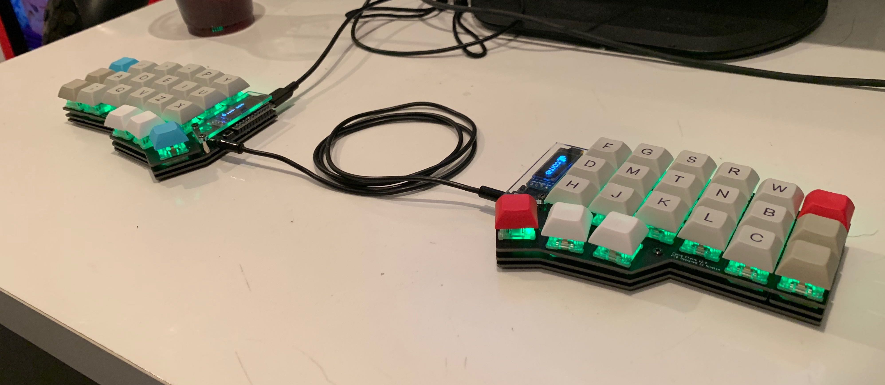
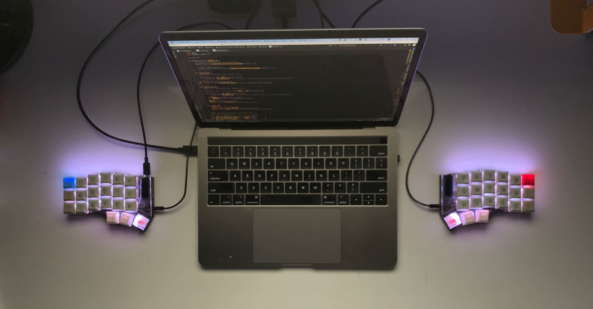

コルネキーボード (Corne Keyboard) は、<a href="https://twitter.com/foostan" target="_blank">@foostan</a>さんが設計している自作キーボード。ハッシュタグは <a href="https://twitter.com/search?q=%23crkbd&src=typd" target="_blank">#crkbd</a> 。  
設計図はオープンソースになっており、GitHub (<a href="https://github.com/foostan/crkbd/" target="_blank">foostan/crkbd</a>) にて公開されている。

コルネキーボードには種類がいくつかあり、自分はそのうちの<a href="https://github.com/foostan/crkbd/blob/master/corne-cherry/doc/buildguide_jp.md" target="_blank">Corne Cherry</a>という種類のものを組んだ。現在は遊舎工房さんにて<a href="https://yushakobo.jp/shop/corne-cherry/" target="_blank">通販</a>や<a href="https://yushakobo.jp/news/2018/12/07/storeopen/" target="_blank">実店舗</a>でキットが販売されている様子。

## 完成物

見た目と使い心地ともにとても満足しています。会社で毎日バリバリ使ってます。






## 出会い

常日頃から、左右分離式のキーボードほしいな〜と思っており、はじめは Ergodox EZ あたりを買おうかと思っていたが、Twitter かどこかに流れてきた Corne Cherry の写真を見て一目惚れしたのがきっかけ。

## Corne Cherry のいいところ

### 3 行 + 親指用キーしか無い

写真を見ての通り、数字列が無いという潔さ。Touch Bar モデルの MacBookPro のキーボードが 64 キーなのに対して Corne Cherry は 42 キーと、約 2/3 になっている。  
そのため、数字、記号、カーソルあたりの入力はレイヤ切り替え機能を使って同時押しで行うことになるが、もともとホームポジションから遠いカーソルキーは ctrl と hjkl 同時押しで代用したりしてたので、個人的にはそこまで問題とは感じなかった。むしろ、どのキーにもホームポジションから 1 キー以内で到達できるので、使い慣れれば最もストレスなく速く打てるレイアウトなのではないか、と思った。

### 見た目がかっこいい

フォルムがかっこよい。無駄がない。  
透明なカバーから覗く OLED ディスプレイもかっこよい。

### 薄い

作者の方いわく薄さにこだわっているとのこと。  
マイコンを外側に出すといった工夫により高さが抑えられており、タイプしやすい。

### ホットスワップ対応

PCB ソケットという電子部品を使うことで、キースイッチ自体にはハンダ付けが不要となっており、ハンダ付け無しで簡単にキースイッチの取り外しや付け替えをすること(ホットスワップ)が可能。  
これは後で判明したことだが、自作キーボードをしばらく使ってるとほぼ 100％他のキースイッチを試したくなってしまうので、ホットスワップが可能というのはかなり大きい。  
また、メンテの際に基板からキースイッチを剥がして裸にできるという点も地味に便利。

## そして購入

Corne Cherry の存在を知った直後、偶然にもその 1 週間後くらいに開かれる技術書典 5 にてキットが販売されると知って、購入を決意。
技術書典の当日は開場 1 時間前くらいに到着して並び、開場後は速攻で販売ブースに向かったが、それでも既に 20〜30 人くらいの行列になっていた。  
自分の番になる頃には、人気のカラーはすでに売り切れていた。自分はマットブラックのキットを購入させてもらった。

## 組み立て

キットには同梱されてないキーキャップやキースイッチを<a href="https://kbdfans.cn/" target="_blank">KBDfans</a>で調達し、ハンダごてなどの工具類は amazon で揃えた。  
中学校ぶりのハンダ付けだったが案外すぐ慣れて、時間はかかったが大きなトラブル無く作り終えることができた。
詳細なビルドログはいろいろな人が書いてくれてる気がするので自分は省略。

※ ただし、オプションの LED のハンダ付けは結構大変だった

## キーマップ

キーボードのファームウェアは OSS の[qmk/qmk_firmware](https://github.com/qmk/qmk_firmware)を利用する。  
そのままでもいいけど、カスタマイズすることでキーマップを自由に変更できたり、OLED ディスプレイに表示する内容を好きに変えたりできるようになる。C 言語で書かれているが、C 言語が得意じゃなくても雰囲気で書き換えればなんとか動く。  
qmk ではレイヤ機能のほか、長押し/短押しでの入力文字の変更なども可能となっている。ほかにも、全部把握できてないけどいろいろな機能がありそう。

今のところのキーマップは以下の形に落ち着いている。  
文字入力のためのレイヤは、デフォルト含め 2 つしか無い。今のところはそれで事足りている。  
キーマップについてもなるべくミニマムで抑えるようにしている。

```text
Default layer
+---+---+---+---+---+---+    +---+---+---+---+---+---+
|TAB| Q | W | E | R | T |    | Y | U | I | O | P | - |
+---+---+---+---+---+---+    +---+---+---+---+---+---+
|CTL| A | S | D | F | G |    | H | J | K | L | ; | ' |
+---+---+---+---+---+---+    +---+---+---+---+---+---+
|SFT| Z | X | C | V | B |    | N | M | , | . | / |SFT|
+---+---+---+---+---+---+    +---+---+---+---+---+---+
            |CMD|L2 |SPC|    |ENT|L2 |ALT|
            +---+---+---+    +---+---+---+

L2 layer
+---+---+---+---+---+---+    +---+---+---+---+---+---+
| ~ | @ | # | # | $ | % |    | & | * | ( | { | [ | _ |
+---+---+---+---+---+---+    +---+---+---+---+---+---+
| ` | 1 | 2 | 3 | 4 | 5 |    | + | = | ) | } | ] | | |
+---+---+---+---+---+---+    +---+---+---+---+---+---+
| ^ | 6 | 7 | 8 | 9 | 0 |    |   |   | < | > | ? | \ |
+---+---+---+---+---+---+    +---+---+---+---+---+---+
            |CMD|   |SPC|    |ENT|   |ALT|
            +---+---+---+    +---+---+---+
```

このほかに、ファンクションキー、音量キー、LED の ON/OFF 切り替えなどの、文字入力以外のためのレイヤもあるがここでは省略。

#### 上記の図で表しきれてないキーマップ

キーが少ない分、同時押しや長押し/短押しによる出し分けなどをある程度駆使することになる。

|      入力       | 入力方法                  |
| :-------------: | :------------------------ |
|       \\        | 右の Shift キーを短く押す |
| 英/かな切り替え | Command/Alt を短く押す    |
|       Esc       | Ctrl + ハイフン           |
| バックスペース  | Ctrl + m                  |

同時押しについては、HHKB 使ってた時代の名残もあり今はソフトウェアで制御してて、Karabiner-Elements を使って制御している。(まだきちんと調べられてないのだけど、ファームウェアでも同時押しのキーマップの設定は可能なのだろうか。)

## 実際に使ってみて

### はじめての左右分離式

初めての左右分離式キーボードだったが、触り始めの頃はかなりおぼつかない感じで、タイピング速度が元の 1 割くらいしか出なかった。今まで 1 つだったものが 2 つに分かれるだけで体の感覚がこうもリセットされるのかという感じ。  
ただ、その違和感は一週間も触ってるといつの間にか消えるし、(アルファベットに関しては)タイピング速度も元の 8 割くらいにはすぐ戻る。自分の場合は使い始めて二週間位でもともと使ってた HHKB のタイピング速度と同じかそれ以上で打てるようになった。

そして、Corne Cherry にしてから肩こりがなくなったような気がする。まぁもともとそこまで肩こりひどいタイプではなかったけど、夜まで仕事しててもデスクワーク起因っぽい体の疲れを殆ど感じなくなった。  
左右分離式だと肩幅で打るので肩を丸めなくて済み、良い姿勢でタイピングできると聞いてたが、たしかに効果ある気がする。

### キーの数

普通のキーボードに比べて数字や記号類がホームポジションから近くなったので、プログラミングがかなり快適になった。キーが全部近いので打ってて楽だし楽しい。  
改めて普通のキーボードを触ると、もはや数字や記号がとても遠く感じるようになっていた。

個人的には、この 42 キーというのは本当に無駄がなく、下限ギリギリのキー数であるように感じている。どのキーもまんべんなく使っていて、使用頻度低いキーが無い。これ以上減ると流石に厳しそう。  
実際には、ごくたま〜にキーが足りないと思うことはある。alt や command が両手に欲しくなったりする。ただそこまで致命的ではない。
もしキー増やすとしても、親指用に左右それぞれ+1 キーくらいかな、と思った。

### 慣れ

前述したように、タイピング速度はアルファベットだけなら 2 週間くらいで長年使ってた HHKB と同等かそれ以上になった。  
問題は記号類で、キー数少ない関係で基本的には一般的な配列を無視して完全に配列を考え直しになるので、なかなか覚えられず最初の方は苦労した。作業に支障出るほどではないけど、今でも結構間違う。記号や数字については、極力自分の中で合理的かつ規則的な配置にしておくと良さそう。  
そのほか、親指部分に ENTER を割り当てたりしているが、それも最初は違和感が大きかった。

単に慣れるために練習しようとしてもやっぱり続かないので、まぁ一応打てるかなというくらいになったらさっさと業務に実戦投入するのが一番てっとり早いと感じた。自分もその戦略だったけど、やはり仕事で使い始めると一瞬で慣れた。

あと、慣れるまでの途中に、なぜか普通のキーボードも Corne Cherry もどちらもまともに打てなくなるフェーズがある。普通のキーボードを打ってるときに親指でエンター押したつもりがスペースキー押してるとか。  
そしてなぜかそこを乗り越えると、特に意識せず使い分けられるようになるし打ち間違いもなくなる。不思議。

### そのほか

たぶん自分のハンダ付けが下手くそなせいなんだけど、使っててキーが急に反応しなくなったり、逆にとあるキーを押すとその列のすべてのキーが反応してしまったりという事が不定期で起きる。はんだ付けがうまくできておらず、ショートさせてしまってる箇所があったりするっぽい。  
さっきまで使えてたのに急に調子悪くなることとかもあり、不具合が起きたときは家に持ち帰ってメンテしている。

今の自分の電子工作の腕前だと、さすがに既成品の安定性には勝てない部分はあると感じた。もっと習熟すれば市販品に遜色ないクオリティで仕上げることが可能になるのだろうか。

## そして沼へ

家にキーボードやキーボードのパーツが際限なく増えていく人たちの気持ちがちょっとわかるようになってきた。

自作キーボードは下手に自分でカスタマイズできてしまうせいで、より快適なキーボードを求めていろいろ試したくなってしまい、終わりが見えない。  
特にキースイッチやキーキャップの誘惑がすごくて、最初に Corne Cherry を作ろうと思った際には必要最低限な数のキースイッチやキーキャップだけを買ったはずなのに、なぜか今ではキーボードをもう 1 つ作れるくらいのそれが余っている。


キースイッチについては、最初は静音黒軸を使ってたけど、静音じゃないほうが打ち心地が軽やかで気持ちいい気がしてしまい、気づいたら BOX 赤軸に変えていた。
そしてそれから一週間経った今、今度は BOX 黒軸が欲しくなっている。多分この週末で買いに行くんだと思う。  
キーキャップについては、DSA Profile のキーキャップじゃなくて Cherry Profile のものを使ってみたくなって気づいたら購入していた。そのほか様々なカラーのキーキャップも少量ずつ購入してストックしています。

そのほか、いま興味があるのは以下。

- MDA か XDA profile のキーキャップ欲しい、かわいい
- 2 台目作りたい
  - 次はもっとうまくはんだ付けできるはずという自信
  - いつのまにかキースイッチとかが余り出していたので、2 台目作れてしまいそうでハードルが下がっている
- BLE Micro Pro でワイヤレス自作キーボードを作って、コードの煩わしさから開放されたい

## まとめ

自作キーボードは、作っても楽しいし、使っても楽しい。  
苦労しながらハンダ付けをして、動作確認時にきちんとキー入力を受け付けてくれたときや、LED がきちんと光ったときの嬉しさとか、いつまでも眺めてしまう感じとかは久々の感覚だった。  
これからも楽しんでいきたい。

## 最後に

End-game への道は遠い

この記事は Corne Cherry Keyboard で書きました。
